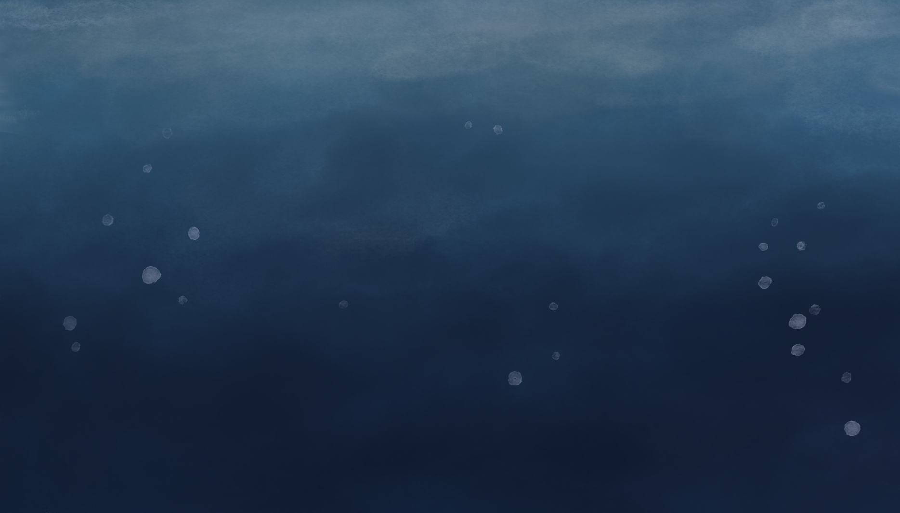
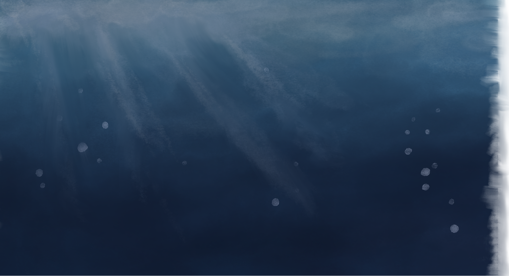

# Project Web Design

The website is a web design project.

                
Tropical coral reefs are one of the planet’s most crucial life support systems. They provide shelter and food for different species of coral, sponges, crustaceans, fishes, and other marine life.

                
However, due to varying factors from the environment, like climate change and human influence, Coral Bleaching events are more frequently occurring.

                
                

                    <h2>Coral Bleaching</h2>
                    <h3>Before</h3>
                    <h3>After</h3>
                

                
                

                There is a lack of awareness on the affect of climate change on coral reefs in Hawai’i and many don’t know the importance of them for their own community.
                

                

                 The lack of care and education on the issue and how to reduce carbon footprint/ human influence on climate change is detrimental.
                

            

<body>
    <main class="site-container">
      <section class="group">
        

          
          
        

        
      </section>
    
    <!-- Midground and Sand Layers -->
      
      
      
      
      
      
      <h1 class="the-issue">The issue</h1>
      

        Tropical coral reefs are one of the planet's most crucial life support systems.  They provide shelter and
        food for different species of coral, sponges, crustaceans, fishes, and other marine life.
      

      

        There is a lack of awareness on the affect of climate change on coral reefs in Hawai'i and many don't know the
        importance of them for their own community.
      

      
      
      
      
      
      
      
      
      
      
      
      
      
      
      
      
      
      
      
      
      
      
      
      
      
      
      <section class="div">
        

        <h2 class="text-wrapper-2">what is coral bleaching?</h2>
      </section>
      
      
      
      

        The lack of care and education on the issue and how to reduce carbon footprint/ human influence on climate
        change is detrimental.
      

      

        However, due to varying factors from the environment, like 
        climate change
         and 
        human influence
        , Coral Bleaching events are more frequently occurring.
      

      

        Signed the first bill in the country that will ban sunscreens containing chemicals harmful to coral reefs.
      

      

        Communities spend most of their time near the shoreline and use underwater resources as a way of life
      

      

        Coral reefs can face threats such as nutrient runoff pollution, physical destruction, and overfishing.
         Globally, climate change impacts such as warming ocean temperatures, rising sea levels, changing storm
        patterns and precipitation, and ocean acidification further threaten corals
      

      

        Significant reliance on reef fish as a resource for coastal communities Availability of food sources and
        income for these communities Increased Storms
      

      

        Climate change threatens the health of Hawai'i's coral reefs and the many species and communities that depend on
        them
      

      

        Impacts cultural customs and day-to-day life, such as responsible fishing and surfing.
      

      
Today, Waikīkī and Shark's Cove have distinct differences

      
1893

      
1900s

      
1950s

      
1967

      
1996

      
2014

      
2018

      
1998

      <h2 class="text-wrapper-17">History</h2>
      

      
      
      
      
      
      
      
      

      
      
      
      
      
      <h2 class="text-wrapper-18">Importance</h2>
      <h2 class="text-wrapper-19">INFLUence</h2>
      
environmental and human

      <h2 class="hawaii-communities">Hawaii communities affected</h2>
      
      <h2 class="text-wrapper-21">Taking</h2>
      <h2 class="text-wrapper-22">action</h2>
      

      

      

      

        
        
        
        
        
        
        
        
        
      

      
water bottle

      
[scuba diver?]

      
[may combine with importance]

      
[hand-drawn]

      
[sun]

      
      
      <article class="image">
        

          United States' overthrow of the Kingdom of Hawaiʻi, dramatically changing the landscape of Oʻahu shores and
          coral reefs
        

      </article>
      <article class="div-wrapper">
        

          Sugar cane industry grew, new agricultural techniques were developing. These advances resulted in the
          introduction of herbicides in the Hawaiian Islands
        

      </article>
      <article class="hawai-i-was-looked-wrapper">
        

          Hawaiʻi was looked at as an island paradise full of potential economic enterprise for American banks,
          developers, and agriculture-based corporations Ocean and coral reef systems became marketing tools to
          promote Hawaiʻi as a destination paradise.
        

      </article>
      <article class="coral-bleaching">
before
</article>
      
coral bleaching

      <article class="hanauma-bay">
        
Hanauma Bay on O'ahu established as marine protected area

      </article>
      
Hawaiian Monk Seal

      
Green Sea Turtle

      
Hawksbill sea turtles

      

      <article class="kaneohe-coral">
        
First major coral bleaching in Hawaii occurred in Kāneʻohe Bay

      </article>
      <article class="image-2">
        

          The US Coral Reef Task Force (USCRTF) was established in 1998 by Presidential Executive Order to lead U.S.
          efforts to preserve and protect coral reef ecosystems.
        

      </article>
      <article class="image-3">
        
Second severe bleaching event around Kauaʻi, Oʻahu, and Maui

      </article>
      

        
        

      

      
      

        With loss of coral reefs, there's an increased risk of natural disasters  Reefs help break ocean
        waves, slowing them down before they crash into the shoreline  Reefs give flood protection to hawaii
        residents helping prevent millions of dollars in damage each year
      

      

      
      

      

      

        
        
        
        
        
      

      

      
Map

      

        Responsibility and duty of 
        local residents
        ,  
        tourists
        , and the  
        Hawaiʻi state government
      

      
beach cleanups and restrain from leaving trash on the shores

      

        preventing harmful chemicals from entering the ocean use reef-safe sunscreens
      

      

        government
         in Hawaiʻi can implement 
        policy change 
         
        maintaining and enhancing marine managed areas blackout fishing dates
      

      
increased signage to not walk on or take out reefs

      

        Through better education, spreading awareness, and enhance knowledge of human, land, and sea:
        
        coral reef interactions
      

      
      
      
      
      
      
      
      
      
      
      
      
      
      
      
      
      
      
      

      

      <nav class="nav-bar" aria-label="Page navigation">
        

          <button class="ellipse-5" aria-label="Navigate to section 1"></button>
          <button class="ellipse-5" aria-label="Navigate to section 2"></button>
          <button class="ellipse-5" aria-label="Navigate to section 3"></button>
          <button class="ellipse-5" aria-label="Navigate to section 4"></button>
          <button class="ellipse-5" aria-label="Navigate to section 5"></button>
          <button class="ellipse-5" aria-label="Navigate to section 6"></button>
          <button class="ellipse-5" aria-label="Navigate to section 7"></button>
          <button class="ellipse-5" aria-label="Navigate to section 8"></button>
        

      </nav>
      <button class="sound-button" aria-label="Toggle sound"></button>
    </main>
  </body>
